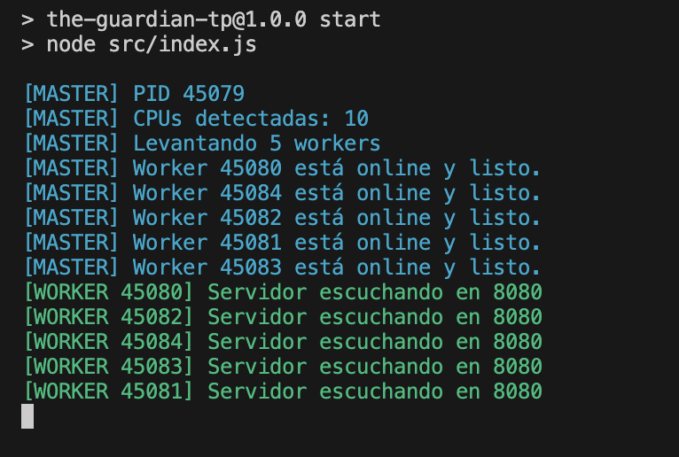
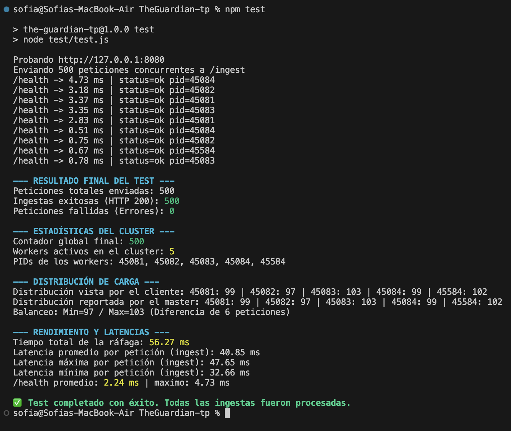
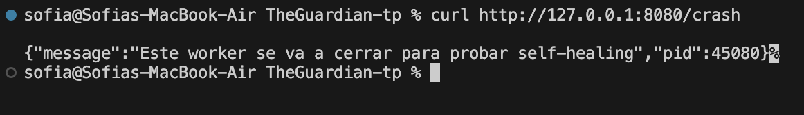
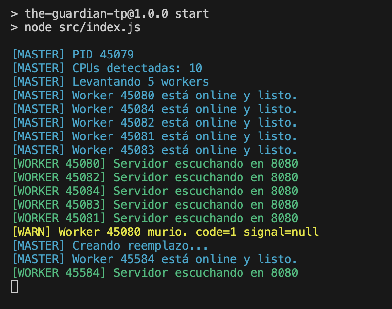

# The Guardian

## Comandos para mostrar el TP

Terminal 1:

```bash
npm start
```

Salida esperada:



Terminal 2:

```bash
npm test
```

Salida esperada:



Para self-healing:

```bash
curl http://127.0.0.1:8080/crash
```

Respuesta del comando:



El master detecta la caída y crea un nuevo worker:


